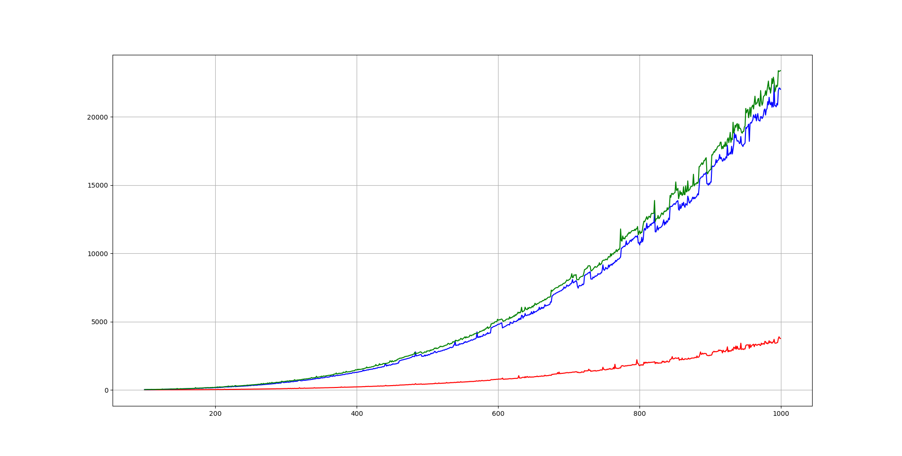
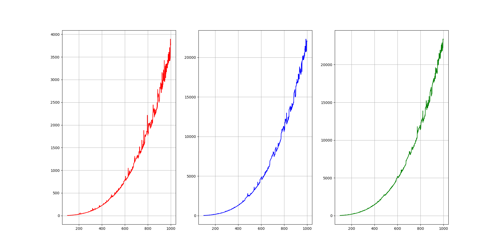

# Matrix
線形代数課題用リポジトリ
## 環境
* 0S:windosw11 wsl Ubuntu20.04
* gccバージョン:gcc version 9.4.0 (Ubuntu 9.4.0-1ubuntu1~20.04.1) 
* C++バージョン:c++17
## コンパイル方法
Matrixディレクトリに移動後以下のコマンドを実行
```bash
g++ -Wall -std=c++17 src/main.cpp
```
## 実行方法
```bash
./a.out
```
# 実行速度測定
matplotlibを使うための環境構築
```bash
sudo apt-get install python3.8-dev
```
numpyとmatplotlibインストール
```bash
sudo apt install python3-numpy
sudo apt install python3-matplotlib
```
## コンパイル
```bash
g++ -Wall -std=c++17 src/test.cpp -I /usr/include/python3.8 -lpython3.8 -O3
```
## 実行結果



# Eigenライブラリとの比較
## wslにEigenのインストール
```bash
sudo apt install libeigen3-dev
```
